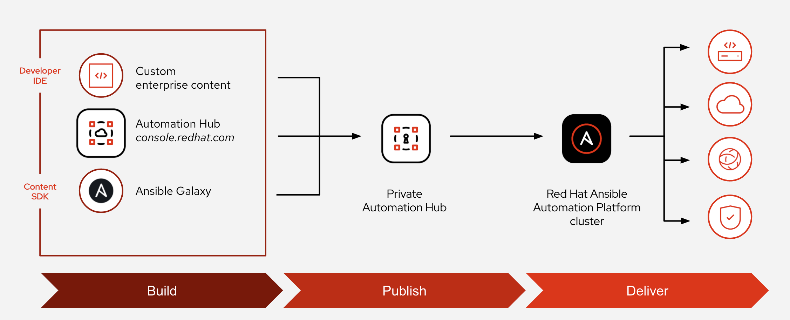
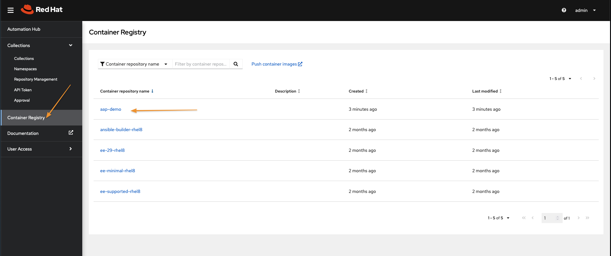

:pygments-style: tango
:source-highlighter: pygments
:icons: font
ifndef::env-github[:icons: font]
ifdef::env-github[]
:status:
:outfilesuffix: .adoc
:caution-caption: :fire:
:important-caption: :exclamation:
:note-caption: :paperclip:
:tip-caption: :bulb:
:warning-caption: :warning:
endif::[]

=== Introduction to AAP 2.x - Ansible Automation Hub

Section Info Here

==== Private Automation Hub

image::images/Section2-a1519.png[title="Ansible *Private* Automation Hub - Collections", align="center"]

image::images/Section2-57706.png[title="Ansible *Private* Automation Hub - Container Registry (Execution Environments)", align="center"]

==== Custom Execution Environments

image::images/Section2-ccd46.png[title="Ansible Execution Environments", align="center"]

image::images/Section2-207ba.png[title="Ansible Execution Environments - Build Process", align="center"]

image::images/Section2-d9595.png[title="Ansible Execution Environments - *ansible-builder*", align="center"]

.*execution-environment.yml* File to Define Custom EE
[source,yaml]
----
---
version: 1
build_arg_defaults:
  EE_BASE_IMAGE: 'hub.lab.example.com/ee-minimal-rhel8:2.0' <1>
  EE_BUILDER_IMAGE: 'hub.lab.example.com/ansible-builder-rhel8:2.0' <2>
dependencies:
  galaxy: requirements.yml <3>
  python: requirements.txt <4>
  system: bindep.txt <5>
----
<1> Defines base container image to be used for creating the EE
<2> Defines the builder image to be used for the EE
<3> Points to file containing the Collections and Roles to be installed and included in the EE
<4> Points to file containing the required Python components to be installed and included in the EE
<5> Points to file containing the system applications to be installed in the EE

.*requirements.yml*
[source,yaml]
----
---
collections:
  - name: /build/exercise.motd.tar.gz <1>
    type: file <2>
----
<1> Defines collections or roles to be included in the container image.
<2> Defines type of collection or role.

.*requirements.txt*
[source,txt]
----
# Python dependencies
funmotd <1>
----
<1> Defines Python dependencies needed to be installed on the container image. If multiple Python packages are needed, one package per line is required

.*bindep.txt*
[source,txt]
----
# System-level dependencies
hostname <1>
----
<1> Defines system packages needed to be installed on the container image. If multiple packages are needed, one package per line is required.

==== DEMO - Creating a Custom Execution Environment and Publishing to Private Automation Hub

.DEMO - *Creating a Custom Execution Environment*
====

. Switch to correct directory
+
[source,bash]
----
[student@workstation ~]$ cd /home/student/Github/AAP_Webinar/Future/Custom_EE/EE
----

. Install *ansible-builder*
+
[source,bash]
----
[student@workstation EE]$ sudo yum install -y ansible-builder
----
+
[NOTE]
======
The *execution-environment.yml*, *requirements.yml*, *requirements.txt*, and *bindep.txt* have already been created to save time. Normally these files would be created by the administrator creating the custom execution environment.
======

. View or create the *execution-environment.yml* file
+
[source,yaml]
----
[student@workstation EE]$ cat execution-environment.yml
---
version: 1
build_arg_defaults:
  EE_BASE_IMAGE: 'hub.lab.example.com/ee-minimal-rhel8:2.0'
  EE_BUILDER_IMAGE: 'hub.lab.example.com/ansible-builder-rhel8:2.0'
dependencies:
  galaxy: requirements.yml
  python: requirements.txt
  system: bindep.txt
----

. View or create the *requirements.yml* File
+
[source,bash]
----
[student@workstation EE]$ cat requirements.yml
---
collections:
  - name: /build/exercise.motd.tar.gz
    type: file
----

. View or create the *requirements.txt* File
+
[source,bash]
----
[student@workstation EE]$ cat requirements.txt
 # Python dependencies
funmotd
----

. View or create the *bindep.txt* File
+
[source,bash]
----
[student@workstation EE]$ cat bindep.txt
 # System-level dependencies
hostname
----

. Run the *ansible-builder create* command to create the structure for the build process
+
[source,bash]
----
[student@workstation EE]$ ansible-builder create
Complete! The build context can be found at: /home/student/Github/AAP_Webinar/Future/Custom_EE/EE/context
----
+
[IMPORTANT]
======
This is necessary so that we can copy the file *exercise.motd.tar.gz* to the correct directory so it will be mounted and available in the container image and build process.
======

. View created files and directory structure
+
[source,bash]
----
[student@workstation EE]$ tree context/
context/
├── _build
│   ├── bindep.txt
│   ├── requirements.txt
│   └── requirements.yml
└── Containerfile

1 directory, 4 files
----

. Copy the *exercise.motd.tar.gz* to the *context/_build* location so it can be mounted properly
+
[source,bash]
----
[student@workstation EE]$ cp collection-files/exercise.motd.tar.gz context/_build/
----

. Create the *ee-motd-demo* Execution Environment Image
+
[source,bash]
----
[student@workstation EE]$ ansible-builder build -t ee_aap_demo:latest
Running command:
  podman build -f context/Containerfile -t ee_aap_demo:latest context
Complete! The build context can be found at: /home/student/Github/AAP_Webinar/Future/Custom_EE/EE/context
----

. Verify container image was built using the *podman images* Command
+
[source,bash]
----
[student@workstation EE]$ podman images
REPOSITORY                                 TAG     IMAGE ID      CREATED         SIZE
localhost/ee_aap_demo                      latest  3bfe381575fa  6 minutes ago   419 MB
----

====

.DEMO - *Using and Testing a Custom Execution Environment*
====

. Change to correct directory
+
[source,bash]
----
[student@workstation ~]$ cd /home/student/Github/AAP_Webinar/Future/Custom_EE
----

. Ensure that *ansible-navigator* is using the correct Ansible Execution Environment
+
[source,yaml]
----
[student@workstation Custom_EE]$ cat ansible-navigator.yml
---
ansible-navigator:
  execution-environment:
    enabled: true
    environment-variables:
      set:
        ANSIBLE_CONFIG: ansible.cfg
    image: localhost/ee_aap_demo:latest
  logging:
    level: critical
  mode: stdout
----

. Create or View Playbook
+
[source,yaml]
----
[student@workstation Custom_EE]$ cat Custom_EE_Playbook.yml
---
- name: Playbook to Configure the Message of the Day with a Custom EE
  hosts: servera
  collections:
    - exercise.motd
  roles:
    - name: exercise.motd.banner
----

. Execute Playbook
+
[source,bash]
----
[student@workstation Custom_EE]$ ansible-navigator run Custom_EE_Playbook.yml -b <1>
----
<1> The *-b* is placed on there to elevate priviliges.

. Test to see if the MOTD was deployed to the server
+
[source,bash]
----
[student@workstation EE]$ ssh servere
Activate the web console with: systemctl enable --now cockpit.socket

This system is not registered to Red Hat Insights. See https://cloud.redhat.com/
To register this system, run: insights-client --register

================================================================================
================================================================================
==                                                                            ==
==                     This system is managed by Ansible.                     ==
==                                   AAP2.0                                   ==
==                                                                            ==
================================================================================
================================================================================

Last login: Tue Jan 25 16:17:04 2022 from 172.25.250.9
----

====

.DEMO - *Publishing a Custom Execution Environment*
====

. Change to correct directory
+
[source,bash]
----
[student@workstation ~]$ cd /home/student/Github/AAP_Webinar/Future/Custom_EE
----
+
[NOTE]
======
Not really needed as we are using the PODMAN commands to push images, but done for consistency.
======

. Tag the image with the Podman command to prepare the push to *hub.lab.example.com*
+
[source,bash]
----
[student@workstation EE]$ podman tag localhost/ee_aap_demo:latest hub.lab.example.com/aap-demo:latest
----

. Push the image to private automation hub
+
[source,bash]
----
[student@workstation EE]$ podman push hub.lab.example.com/aap-demo:latest
Getting image source signatures
Copying blob 38345e1102be done
Copying blob df2b2b67ec7f done
Copying blob fa751636af06 done
Copying blob a65a1b01a4d2 done
Copying blob af092941766c done
Copying blob efebe3fe0d93 done
Copying blob 9c99e40eecd0 done
Copying config 3bfe381575 done
Writing manifest to image destination
Storing signatures
----
+
.Repository Login
[WARNING]
======
It might be necessary to perform a *podman login* for the remote container registry.

.*Regsitry Login*
[source,bash]
----
podman login hub.lab.example.com
----
======

. Login to the Private Automation hub
+
image::images/Section2-e5af7.png[title="Automation Hub Login", align="center"]

. Navigate to Container Registry and look for the *aap-demo* Container
+

. Clean up *servere* and show that MOTD has been reset
+
[source,bash]
----
[student@workstation Custom_EE]$ ansible-playbook MOTD_Cleanup.yml

PLAY [Playbook to Cleanup MOTD for Testing Custom EE] ******************************************************************

TASK [Gathering Facts] *************************************************************************************************
ok: [servere]

TASK [Reset MOTD] ******************************************************************************************************
changed: [servere]

PLAY RECAP *************************************************************************************************************
servere                    : ok=2    changed=1    unreachable=0    failed=0    skipped=0    rescued=0    ignored=0
----
+
[source,bash]
----

[student@workstation Custom_EE]$ ssh servere
Activate the web console with: systemctl enable --now cockpit.socket

This system is not registered to Red Hat Insights. See https://cloud.redhat.com/
To register this system, run: insights-client --register

I'm the clean MOTD Banner
----

. Test with the image coming from Private Automation Hub
+
[source,bash]
----
[student@workstation Custom_EE]$  ansible-navigator run --pp always --eei hub.lab.example.com/aap-demo:latest -m stdout Custom_EE_Playbook.yml -b

----------------------------------------------------------------------
Execution environment image and pull policy overview
----------------------------------------------------------------------
Execution environment image name:  hub.lab.example.com/aap-demo:latest
Execution environment image tag:   latest
Execution environment pull policy: always
Execution environment pull needed: True
----------------------------------------------------------------------
Updating the execution environment
----------------------------------------------------------------------
Trying to pull hub.lab.example.com/aap-demo:latest...
Getting image source signatures
Copying blob 3c9fdae16a64 skipped: already exists
Copying blob 5c4402ce71c4 skipped: already exists
Copying blob 69ebc448681d [--------------------------------------] 0.0b / 0.0b
Copying blob 495ff1ef2828 [--------------------------------------] 0.0b / 0.0b
Copying blob 80be453030cf [--------------------------------------] 0.0b / 0.0b
Copying blob 642d458785a1 [--------------------------------------] 0.0b / 0.0b
Copying blob 00fe5380b165 [--------------------------------------] 0.0b / 40.3MiB
Copying config 3bfe381575 done
Writing manifest to image destination
Storing signatures
3bfe381575fa7606cb745bfe8227d0cbf59b4d91dc7bd7d811a1fcfe28022919

[student@workstation Custom_EE]$
----

====
