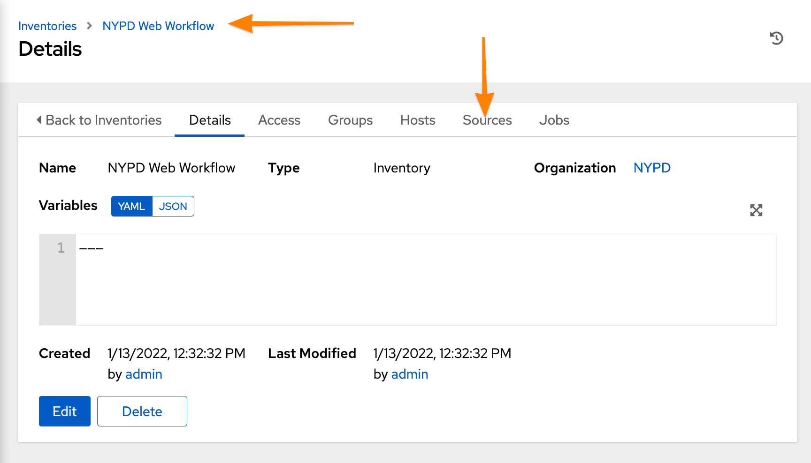

:pygments-style: tango
:source-highlighter: pygments
:icons: font
ifndef::env-github[:icons: font]
ifdef::env-github[]
:status:
:outfilesuffix: .adoc
:caution-caption: :fire:
:important-caption: :exclamation:
:note-caption: :paperclip:
:tip-caption: :bulb:
:warning-caption: :warning:
endif::[]

=== Introduction to AAP 2.x - Ansible Controller (formerly Ansible Tower)

Section Info Here

==== Organizations, Teams, and RBAC

.DEMONSTRATION - Creating an Organization with Users and Teams
====

.Creating an Organization
. Login to *Ansible Controller*
+
image::images/Section3-fb75b.png[title="Ansible Controller Login", align="center"]

. Click *Organizations*
+
image::images/Section3-85ca8.png[title="Ansible Controller - *Organizations*", align="center"]

. Click *Add*
+
image::images/Section3-1adef.png[title="Ansible Controller - *Adding an Organization*", align="center"]

. Create the new organization with the appropriate details and then click *Save*
.. *Name*: Required for name of Organization
.. *Description*: _Optional but helpful_
.. *Execution Environment*: Default execution environment for playbooks, projects, and workflows in the environment.
+
image::images/Section3-3d066.png[title="Ansible Controller - *Configuring the Organization*", align="center"]
+
.Default Execution Environment
[TIP]
======
It is helpful to setup the default execution environment (EE) which will control the running of Ansible playbooks within your Organization. It is possible for individual projects and playbooks to be selectively run with another execution environment, but the default EE will be used if another EE isn't specified.

In the above example, the *Ansible Engine 2.9 execution environment* was selected as it has the best compatibility with older playbooks before the realigned modules and collections. Ansible Engine 2.9 can utilize collections, but also has the mapping for the Ansible modules allowing older playbooks to run without updating to using FQCN.
======

.Creating a Team

. Click on *Teams*
+
image::images/Section3-0cff1.png[title="Ansible Controller - *Creating a Team*", align="center"]

. Click *Add* and fill in appropriate values and then click *Save*
.. *Name*: Required for name of team
.. *Organization*: Required to select an existing organization from drop-down
... Click magnifying glass and select Organization
+
image::images/Section3-d2ee3.png[title="Ansible Controller - *Configuring a Team*", align="center"]
+
image::images/Section3-664c9.png[title="Ansible Controller - *Selecting an Organization*", align="center"]
+
image::images/Section3-43443.png[title="Ansible Controller - *Completing Team Creation*", align="center"]

.Creating Users

. Click *Users*
+
image::images/Section3-6a687.png[title="Ansible Controller - *Creating a User*", align="center"]

. Click *Add* and fill in appropriate information and click *Save*
+
image::images/Section3-664c9.png[title="Ansible Controller - *Selecting an Organization*", align="center"]
+
image::images/Section3-cae5a.png[title="Ansible Controller - *Configuring a User*", align="center"]

.Adding a User to a Team

Adding users to a team can be done multiple ways, but in this example, we will be modifying a recently created user and use the *Teams* option on the User *Details* tab.

. Click on *Teams*
+
image::images/Section3-aead5.png[title="Ansible Controller - *User Teams Menu*", align="center"]

. Click the *Associate* button to search for and select a team, then click *Save*
+
image::images/Section3-3aab6.png[title="Ansible Controller - *User Team(s) Selection*", align="center"]

. Verify user was associated with the correct team(s).
+
image::images/Section3-8bcde.png[title="Ansible Controller - *User Team(s) Verification*", align="center"]

.Teams
[TIP]
======
Teams are used to group users together so that RBAC controls can be more easily managed at a group level versus an individual user level. It is still possible to give individual users additional privileges, but teams is the preferred way of permission management.
======
====

==== Inventories and Credentials

.DEMONSTRATION - Creating an Inventories and Credentials
====

.Creating an Iventory
. Login to *Ansible Controller*
+
image::images/Section3-fb75b.png[title="Ansible Controller Login", align="center"]

. Click *Inventories* and then click *Add* to Add an Inventory
+
image::images/Section3-a686f.png[title="Ansible Controller - Inventory", align="center"]

. Provide and inventory *_Name_* and *_Organization_* and then click *Save*
+
image::images/Section3-664c9.png[title="Ansible Controller - *Selecting an Organization*", align="center"]
+
image::images/Section3-cb43f.png[title="Ansible Controller - New Inventory", align="center"]

. Add hosts to the inventory by clicking *Hosts* and then click *Add*
+
image::images/Section3-de863.png[title="Ansible Controller - Managed Hosts in Inventory", align="center"]

. Provide the inventory hostname of the host and any host-based variables if desired and click *Save*. Repeat for multiple hosts.
+
image::images/Section3-8bf61.png[title="Ansible Controller - Adding a Host to Inventory", align="center"]

.Creating Credentials

. Click *Credentials* and then click *Add* to add a new credential
+
image::images/Section3-cb657.png[title="Ansible Controller - Credentials", align="center"]

. Create the credential specifying the name, type, and bind to organization if desired and click *Save*.
** NOTE - SSH credentials are *Machine Credentials*
+
image::images/Section3-59072.png[title="Ansible Controller - Machine Credentials", align="center"]
+
image::images/Section3-22db8.png[title="Ansible Controller - Credentials - Privileged User", align="center"]
+
.Privilege Escalation
[TIP]
======
It is necessary to provide privilege escalation information as with Ansible Controller, this is where the information and configuration must come from for execution environments (EEs).
======
====

==== Projects and Job Templates

.DEMONSTRATION - Creating an Projects and Job Templates
====

.Creating a Project
. Login to *Ansible Controller*
+
image::images/Section3-fb75b.png[title="Ansible Controller Login", align="center"]

. Click *Projects* and then click *Add* to Add a Project
+
image::images/Section3-b8165.png[title="Ansible Controller - Projects", align="center"]

. Create a New Project with a Name, Organization and Source Control Credential
** URL: git@github.com:tmichett/AAP_Webinar.git
+
image::images/Section3-bab7f.png[title="Ansible Controller - Creating Project from Github Source", align="center"]

.Creating a Job Template

. Click *Templates* and then click *Add* to Add (*Add job template) to create a job template.
+
image::images/Section3-48ade.png[title="Ansible Controller - Job Templates", align="center"]

. Create the new job template and then click *Save*
** Provide a name
** Provide job type (*run*)
** Provide *Inventory*
** Provide *Project*
** Select *Playbook*
** Select *Credentials*
** Select *Privilege Escalation* option
+
image::images/Section3-b8889.png[title="Ansible Controller - Job Template Details", align="center"]
+
image::images/Section3-21de7.png[title="Ansible Controller - Job Template Details cont.", align="center"]
+
.Privilege Escalation
[IMPORTANT]
======
It is important to know what the playbook does and whether it requires privilege escalation. A proper playbook might already have this defined, but it also allows you to assign it to the job from this menu.
======

. Launch the job by clicking *Launch*
+
image::images/Section3-8032b.png[title="Ansible Controller - Job Template Launch", align="center"]
+
image::images/Section3-39929.png[title="Ansible Controller - Job Results Output Verification", align="center"]

. Verify webserver is running and accessible.
+
[source,bash]
----
[student@workstation ~]$ curl serverd
I'm an awesome webserver for the NYPD and I know Castle!!
----

====

==== Workflows

In order to create job workflows, projects and existing job templates must already be created before they can be put together as a job workflow template.

.DEMONSTRATION - Job Workflow Templates
====
For this demonstration, it will be necessary to create two new *Job Templates* that will be linked together in a *Job Workflow Template*. We will be leveraging the already created project *NYPD Webserver* for existing playbooks and inventories. We will also create a dynamic inventory based on imported inventory from the project.

.Creating a Project-Based Inventory Source

. Login to *Ansible Controller*
+
image::images/Section3-fb75b.png[title="Ansible Controller Login", align="center"]

. Click *Inventories* and then click *Add*
+
image::images/Section3-a686f.png[title="Ansible Controller - Inventory", align="center"]

. Assign a *Name* and *Organization* to the Inventory and then click *Save*
+
image::images/Section3-67077.png[title="Ansible Controller - Inventory Creation", align="center"]

. Click *Sources* to create an inventory source
+

. Click *Add* to add an inventory source
+
image::images/Section3-ec813.png[title="Ansible Controller - Adding Inventory Sources", align="center"]

. Provide a *Name* and choose *Sourced from a Project* as source and click *Save*
.. Select the *Project* and *Inventory file*
.. Check *Update on launch*
+
image::images/Section3-f536a.png[title="Ansible Controller - Configuring Inventory Sources", align="center"]

. Click *Sync* to perform a synchronization
+
image::images/Section3-63956.png[title="Ansible Controller - Synchronizing Inventory Sources", align="center"]

. Click *Inventories* to verify the inventory and select *NYPD Web Workflow*
+
image::images/Section3-3c016.png[title="Ansible Controller - Verifying Inventory Sources", align="center"]

. Click *Hosts* to view hosts
+
image::images/Section3-2b4b7.png[title="Ansible Controller - Verifying Inventory Hosts from Project", align="center"]

. Click *Groups* to view host groups
.. Click on a group name to see hosts in group and click *Hosts*
+
image::images/Section3-1734b.png[title="Ansible Controller - Verifying Inventory Group from Project", align="center"]
+
image::images/Section3-dc1e0.png[title="Ansible Controller - Verifying Inventory Group *(Hosts)* from Project", align="center"]

.Project Based Inventory
[IMPORTANT]
======
The above example shows how to create a dynamic inventory that is sourced from a project. This would can be done to ensure that you have the same inventory and host systems as the developers. It is not 100% necessary to have inventory in the projects, but some people prefer to keep host inventory in projects and this is a great method in keeping developer inventory in sync with what is stored in Ansible Controller.
======

.Creating a Job Workflow Template
. Login to *Ansible Controller*
+
image::images/Section3-fb75b.png[title="Ansible Controller Login", align="center"]

. Click *Templates* and then click *Add* and *(Add job template)* to create a new Job Template
+
image::images/Section3-fb1e7.png[title="Ansible Controller - Job Templates", align="center"]

. Complete the form for the NYPD Dev Webserver and click *Save*
.. *Name*: _NYPD Dev Webserver_
.. *Job Type*: _run_
.. *Inventory*: _NYPD Web Workflow_
.. *Project*: _NYPD Webserver_
.. *Playbook*: _Future/NYPD/NYPD_Web_Workflow.yml_
.. *Credentials*: _NYPD Machine SSH Creds_
.. *Variables*: _inv_host_var: servere_
.. *Privilege Escalation*: _Checked_
+
image::images/Section3-4f4b5.png[title="Ansible Controller - Job Template Parameters", align="center"]
+
image::images/Section3-a61cf.png[title="Ansible Controller - Job Template Parameters cont.", align="center"]

. Create a new Job template using steps above with the following values.
.. *Name*: _NYPD Test Webserver_
.. *Job Type*: _run_
.. *Inventory*: _NYPD Web Workflow_
.. *Project*: _NYPD Webserver_
.. *Playbook*: _Future/NYPD/NYPD_Web_Workflow.yml_
.. *Credentials*: _NYPD Machine SSH Creds_
.. *Variables*: _inv_host_var: serverf_
.. *Privilege Escalation*: _Checked_
+
image::images/Section3-78f83.png[title="Ansible Controller - Job Template Parameters for NYPD Test Webserver", align="center"]

. Click *Templates* then click *Add* and select *Add workflow template*
+
image::images/Section3-33a10.png[title="Ansible Controller - Job Workflow Template", align="center"]

. Provide a *Name* and select the appropriate items
.. *Inventory*: _Leave Blank_ (Will use inventory specified for Job Templates)
.. *Organization*: _NYPD_
+
image::images/Section3-b08c7.png[title="Ansible Controller - Job Workflow Template Details", align="center"]

====
